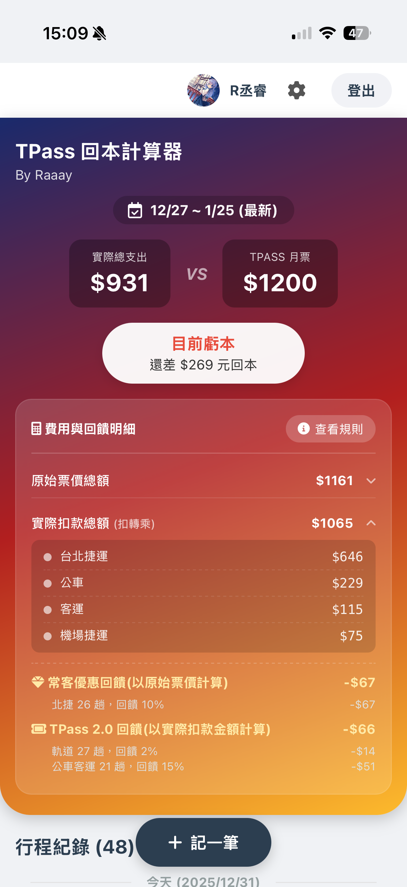
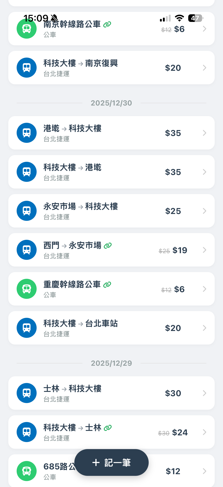
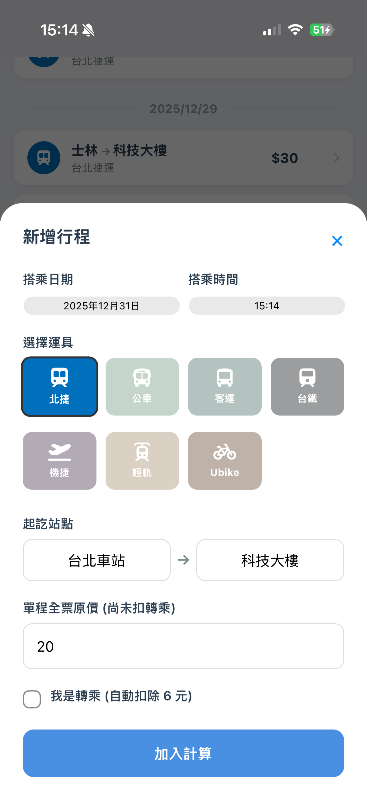

<div align="center">

# 🚌 基北北桃 TPASS 回本計算機

**專為基北北桃通勤族打造 · 你的通勤精算師**

[ **🚀 立即啟動 Web App** ](https://111319022.github.io/tpass-app/)
·
[ 🐛 回報問題 ](https://github.com/111319022/tpass-app/issues)

<br>


<br>
<br>

</div>

---

## 💡 為什麼做這個？

通勤月票 $1200 買下去，到底有沒有回本？
市面上的記帳軟體無法處理 **「北捷常客優惠」** 的階梯式回饋，也無法計算 **「TPASS 2.0」** 複雜的運具補貼。

這個 App 就是為了解決這個問題——**它不只是記帳，更是你的通勤精算師。**

---

## ✨ 核心體驗

### 🎯 只有重點，沒有廢話
不同於傳統記帳 App 的繁瑣，我們專注於通勤場景。
- **智慧帶入**：選擇公車，自動填入 $15；選擇學生票，自動變更為 $12。
- **轉乘邏輯**：勾選「轉乘」，系統自動扣除 $8 或 $6 優惠，比你自己算還準。

### 💳 像是你的信用卡帳單
支援 **「多週期管理」**。
你可以隨時查看「1月」還有幾天到期、「2月」已經回本多少。每個週期的啟用日都能獨立設定，完美符合 TPASS 的啟用制邏輯。

### 📱 PWA 原生質感
無需下載，加入主畫面即刻使用。
- **0 秒啟動**：支援離線緩存，打開即用。
- **全螢幕**：移除瀏覽器網址列，沉浸式體驗。
- **跨平台**：iOS / Android / Desktop 通用。

---

## ⚡️ 技術核心

使用最輕量、最穩定的技術棧，確保 App 在任何裝置上都能輕鬆運行。

`HTML5` &nbsp; `CSS3 (Flexbox/Grid)` &nbsp; `JavaScript (ES6+)`

**Backend Services**
`Firebase Authentication` &nbsp; `Cloud Firestore`

**DevOps**
`GitHub Actions (CI/CD)` &nbsp; `Firebase Hosting`

---

## 📸 介面導覽

| **儀表板 (Dashboard)** | **行程紀錄 (History)** | **輸入畫面** |
|:---:|:---:|:---:|
|  |  |  |
| *直觀顯示回本進度與金額* | *自動依日期分組，清晰明瞭* | *簡單直覺的輸入畫面* |


---

## 🚀 快速部署

如果你也想擁有自己的版本：

1. **Clone 專案**
   ```bash
   git clone [https://github.com/111319022/tpass-app.git](https://github.com/111319022/tpass-app.git)
   
2.設定環境 將 firebase-config.js 替換為你自己的 Firebase Project Config。
3.啟動 直接開啟 index.html 即可運行。

<div align="center">

---

Made with 🧠 by Raaay

</div>
